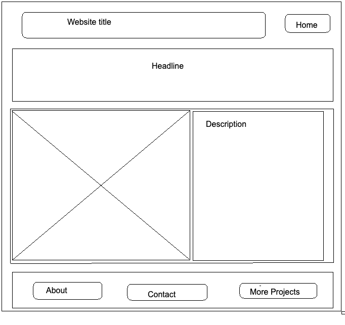
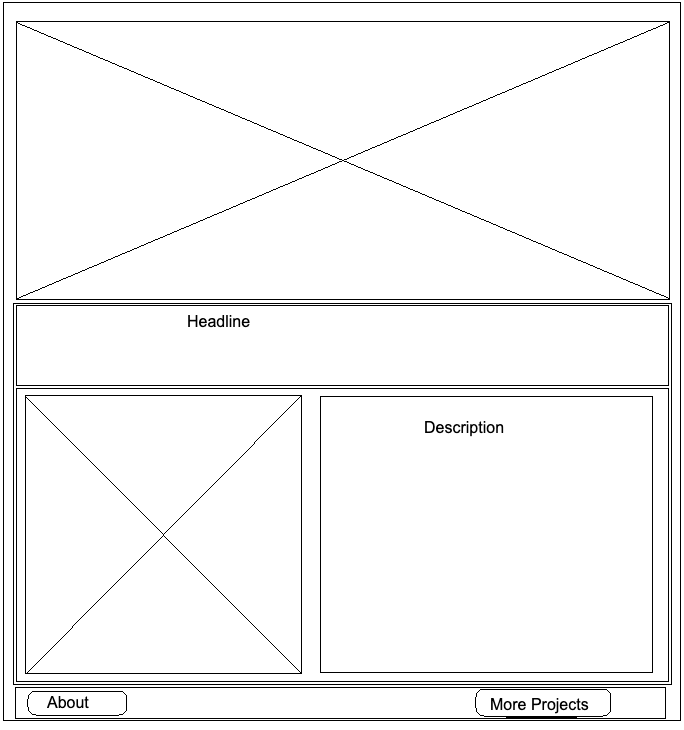

# Assignment 2: Building a Webpage

### My Journey
I started the process by creating my two wireframes:

*Wireframe #1*

*Wireframe #2*

https://pangnasun.github.io/ConnectionsLab/Week-1/Assignment2_BuildWebsite/
