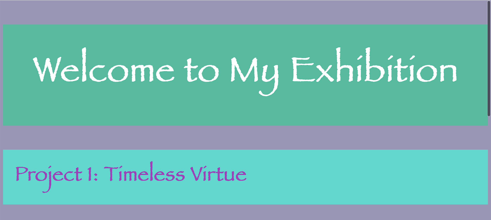

# Assignment 2: Building a Webpage

### My Journey
#### Creating Wireframes
I started the process by creating my two wireframes:

*Wireframe #1*

*Wireframe #2*

I was not quite sure what to include, so designed the most basic wireframe with the elements that I know I will need on my webpage. I liked the first wireframe better, so I used it to start my HTML coding. 

#### HTML Coding
Following the in-clas example, I creaded an HTML file and changed the page title to "Pangna Sun's Projects. Then I added headers, images, and description about my project. 

*Initial Webpage Screenshot #1*

*Initial Webpage Screenshot #2*

The screenshots above show the state of my webstate after I included almost all the necessary components. The webpage looked very plain and the format was very off. For example, the image was too big and the alignemnts of the texts were not proper as well. Thus, I kept in mind when I started CSS styling. 

One problem I encountered was embedding a video to my page. I tried using the *video* tag, but it didn't work because I was using a Youtube video. I did more research and figured that I needed to use the *iframe* tag. I followed an online example but faced with the error below:

*Initial Webpage Screenshot #3*

I did more debuggings, and it turned out that the link of the video *src* has a specific format (requires *"/embed/VideoID"*). Following this format, I was able to add my Youtube video.

### CSS Styling
With all the HTML elements in place, I added a CSS file to make things look better. I formated the headers first because I could just use *h1*, *h2* and *h4*. Then I added classes to other components, so I could format them. It required testings and seeing what made my webpage look good. For example, I adjusted the font and backgound colors of my three headers to get the best contrast. In addition, I also played around with *flex* to position my different components. The result is as shown below:
*Final Webpage Screensho*

https://pangnasun.github.io/ConnectionsLab/Week-1/Assignment2_BuildWebsite/
