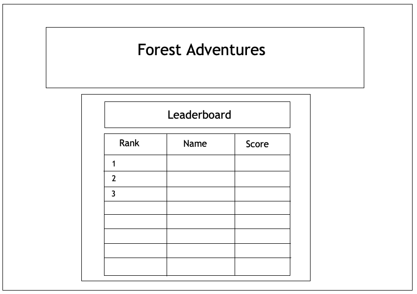
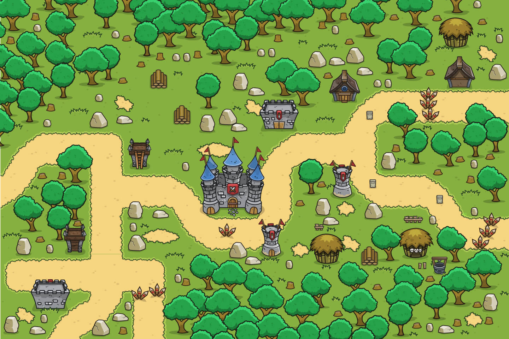
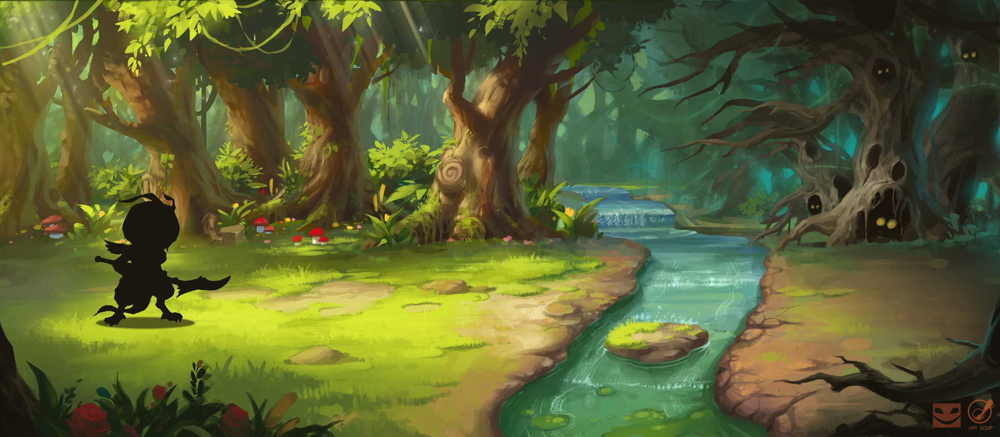

# Final Project

## Concept
My project will be a multiplayer-capable 2D online game where players journey through a dangerous forest to conquer various enemies. Players can tackle these challenges alone or with another player. Their journey will be guided by the game’s storyline and quests. I am still deciding whether I should need a scoring system to motivate players to play this game. 
 
I hope to use p5.play to create animations and make the forest come to live. My aim is to create a very pleasing environment for players to explore.

## Process
### Wireframes
My process began with creating wireframes for my website. Overall, the font sizes and the number of buttons make the pages simple and easy to navigate around. 

The first wireframe determines the layout of the main page, which includes the title, and the *Leaderboard* and *Start Game* buttons. I envisioned players would come to this page and were able to clearly see the title and click on the *Start Game* button to start playing the game.  

*Wireframe for game mainpage*


The second wireframe is for the *Leaderboard* page. This page still has the game title at the top to help users remember what game they are playing. Below the game title is the *Leaderboard* heading and a table that contains the ranks, names, and scores of top 10 players. 

*Wireframe for game leaderboard*


### Sample 2D Forest Games
I started to work on the design of my game by getting inspiration from existing games. First, I went through a huge collection of 2D games with the forest theme. Then I started to look into topdown 2D forest games where players see the whole map of the games. I found many great background images and maps to create various environments for my games. However, it was harder to find character sprites for this type of game because most of them were pixelated and in low quality. The background objects are divided into tilesets, which required extra work to arrange and put them together. Facing these issues, I decided to look into 2D platform games instead. 

*Topdown 2D forest game*

<br>

The one disadvange of a paltfom game is the users are not exposed to the whole map. The background is scrolling from left to right to reveal the rest of the map. This forces players to navigate in a certain direction, making it less immersive than a topdwon 2D game. On the other hand, when it comes to character and background object sprites, there are plenty of resources available. I could use any high quality images for the background of a platform game as well. 

*Platformer 2D forest game*
<br>


### Game Implmentation

Once I obtained the neccessary sprites and background images, I started to begin the coding process. I started with the *index.html* and made sure to include neccessary libraries like *p5js,* *p5.play,* etc. After setting up all the neccesary files connections, the first thing I did in the *javascript* was to create animation from my sprites. Using *p5.play*, I was easily able to get get to work. 

```javascript
function preload() {
    //upload sprites
    troll = new Sprite(240, 200);
    dino.addAni( 'idle', 'assets/dino/idle001.png', 10);
    dino.addAni('walk', 'assets/dino/walk001.png', 10);
    dino.addAni('sleep', 'assets/dino/sleep001.png', 8);
    dino.addAni('attack', 'assets/dino/attack001.png', 12);
    dino.ani = 'idle';
}
```


