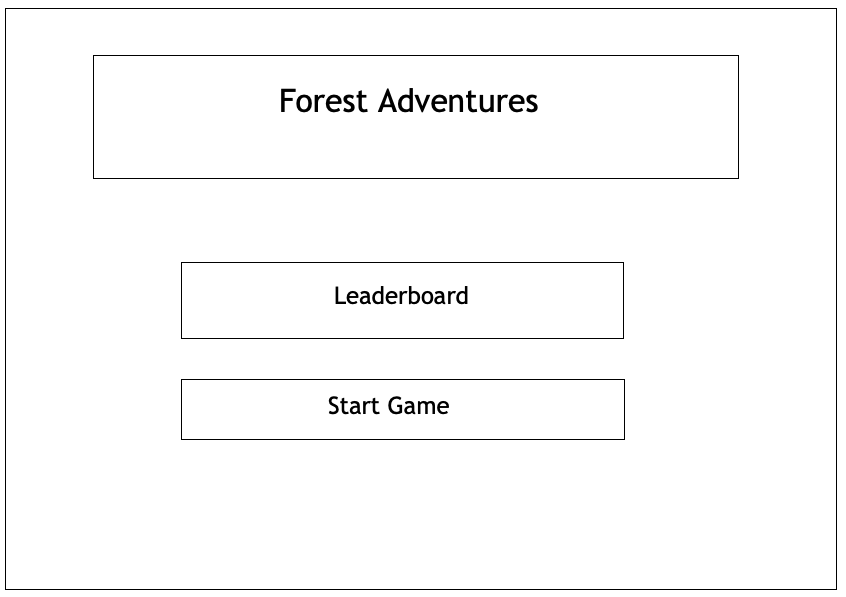

# Final Project

## Concept
My project will be a multiplayer-capable 2D online game where players journey through a dangerous forest to conquer various enemies. Players can tackle these challenges alone or with another player. Their journey will be guided by the game’s storyline and quests. I am still deciding whether I should need a scoring system to motivate players to play this game. 
 
I hope to use p5.play to create animations and make the forest come to live. My aim is to create a very pleasing environment for players to explore.

## Process
### Wireframes
My process began with creating wireframes for my website. Overall, the font sizes and the number of buttons make the pages simple and easy to navigate around. 

The first wireframe determines the layout of the main page, which includes the title, and the *Leaderboard* and *Start Game* buttons. I envisioned players would come to this page and were able to clearly see the title and click on the *Start Game* button to start playing the game.  

*Wireframe for game mainpage*


The second wireframe is for the *Leaderboard* page. This page still has the game title at the top to help users remember what game they are playing. Below the game title is the *Leaderboard* heading and a table that contains the ranks, names, and scores of top 10 players. 

*Wireframe for game leaderboard*


### Sample 2D Forest Games
I started to work on the design of my game by getting inspiration from existing games. First, I went through a huge collection of 2D games with the forest theme. Then I started to look into topdown 2D forest games where players see the whole map of the games. I found many great background images and maps to create various environments for my games. However, it was harder to find character sprites for this type of game because most of them were pixelated and in low quality. The background objects are divided into tilesets, which required extra work to arrange and put them together. Facing these issues, I decided to look into 2D platform games instead. 

*Topdown 2D forest game*

<br>

The one disadvange of a paltfom game is the users are not exposed to the whole map. The background is scrolling from left to right to reveal the rest of the map. This forces players to navigate in a certain direction, making it less immersive than a topdwon 2D game. On the other hand, when it comes to character and background object sprites, there are plenty of resources available. I could use any high quality images for the background of a platform game as well. 

*Platformer 2D forest game*
<br>


### Game Implmentation

Once I obtained the neccessary sprites and background images, I started to begin the coding process. I started with the *index.html* and made sure to include neccessary libraries like *p5js,* *p5.play,* etc. After setting up all the neccesary files connections, the first thing I did in the *javascript* was to create animation from my sprites. Using *p5.play*, I was easily able to get get to work. 

```javascript
function preload() {
    //upload sprites
    troll = new Sprite(240, 200);
    dino.addAni( 'idle', 'assets/dino/idle001.png', 10);
    dino.addAni('walk', 'assets/dino/walk001.png', 10);
    dino.addAni('sleep', 'assets/dino/sleep001.png', 8);
    dino.addAni('attack', 'assets/dino/attack001.png', 12);
    dino.ani = 'idle';
}
```
Once I got my character and enemy sprites to animate, I realized that I needed to create the many version of the same enemes. The best way to handle this repetition is to create a class for them, so I can create unique enemy objects for them. Besides creating a class for the enemies, I also needed to create class for my hero, score, life, etc. 


The most effective *javascript* file that I created was *dictionary.js* where I created variabled that could be refered from other files. I figured that I needed this file when I lost track of the names and locations of variables that I created. Having these variables in one file was time effecient when I needed to create new variables or refer to an old one.  

*snipet from dictionary.js*
```javascript

const BG_SPEED = 2;
const GAME_FRAME_RATE = 40;

let game;
let startup;

let imgBackground;
let bgMusic;
let gameOverImage;
let startupImage;
let startupFont;

let heartImage;
let life;

let scenario;
let score;
let buttonManager;
let scoreBoard;

let currentScene;
let scenes = {};

let level1, level2, level3;

let input, button, greeting;
```

Once I created these "global" variables in the *dictionary.js*, I could initialize them in other files. For example, I used *preload.js* to preload and keep track of all the audio and image files that I used. After the variables were initilized, I could use them in another file, like *game.js*, where the game is actually running.

*snipet from preload.js*
```javascript
function preload() {
    imgBackground = loadImage("assets/images/background/forest3.webp");
    imgHero = loadImage(heroSprite.imagePath);
    imgEnemy = loadImage(enemySprite.imagePath);
    imgEnemyTroll = loadImage(enemyTrollSprite.imagePath);
    imgEnemyFlying = loadImage(enemyFlyingSprite.imagePath);
    gameOverImage = loadImage("assets/images/assets/game-over.png");
    startupImage = loadImage("assets/images/background/forest3.webp");
    heartImage = loadImage("assets/images/assets/heart.png");
    startupFont = loadFont("assets/images/assets/fontStart.otf");
    bgMusic = loadSound("assets/audio/bg_music.mp3");
    

    // Levels
    level1 = loadJSON("levels/01.json");
    level2 = loadJSON("levels/02.json");
    leve3 = loadJSON("levels/02.json");
}

```
*snipet from game.js*
```javascript
 if (hero.collisionCheck(currentEnemy)) {
    this.hurtSound.play();
    life.oneLost();
    hero.setInvincible();
    if (life.current === 0) {
        this.gameOverSound.play();
        noStroke();
        fill('rgba(0,0,0,1)');
        rect(width / 2 - 300, height / 3 -100, 600, 400);
        image(gameOverImage, width * 0.5 - 200, height * 0.5 - 200);
        textSize(65);

        fill('#FFF');
        text('Your Score: ' + parseInt(score.score), width/2 , height/2);


        input = createInput(["enter your name"]);
        // input = createElement('input', "enter your name");
        input.position(width/2 - 100, height/2 + 50);

        button = createButton('submit');
        button.position(input.x + input.width, height / 2 +50);
        button.mousePressed(this.submitInfo);

        // greeting = createElement('h2', 'what is your name?');
        // greeting.position(20, 5);

        textAlign(CENTER);
        textSize(50);

        noLoop();
    }
   }
   life.draw();
   if(life.current > 0) score.displayScore();
   score.addScore();
```
Orgnazing my code into different classes and *javascript* files speeded up my process a lot. I was able to quickly find what I was looking for, and each file does not many lines of code at all. 

Regarding the game mechanics, one feature that I needed to mention is the use of *p5.collide2D*. This library allowed me to calculate collision detection for my 2D sprites. As shown in the code snipet below, I created a function called *collisinCheck()* in my *hero.js* to check when my hero gets in contact with the enemies. The library *p5.collide2D* has a function called *collideRectRect(x1,y1,width1,heigh1t,x2,y2,width,height)*. Provided the coordinates and the widths and heights of my hero and enemy, the fuction could determin whether the two objects collide or not.

```javascript
  collisionCheck(enemy) {
     if (this.invincible) {
         return false;
     }

     return collideRectRect(
         this.x,
         this.y,
         this.imageWidth * this.hitBoxOffset,
         this.imageHeight * this.hitBoxOffset,
         enemy.x,
         enemy.y,
         enemy.imageWidth * this.hitBoxOffset,
         enemy.imageHeight * this.hitBoxOffset,
     );
    }

```

### Database and UI/UX Implementation
After I got my game running, I used *Node.js* to implement the server-client connection. I used *NeDB* to store the top 10 players' names and scores. When there is a new score, the server compares it to the previous records. If the score is within the top 10, the server will store it in the database and the 11th player will be eliminated. The process of setting up and configuring the server-client connection was quicker because of previous experience from project 2.

```javascript
 app.post("/api/scores", (req, res) => {
    const { name, score } = req.body;
    if (name === undefined || score === undefined) {
        res.status(400).send("Invalid request");
    } else {
        let currentHighScore = 0;

        // Get high score
        db.find({})
            .sort({ score: -1 })
            .limit(1)
            .exec((err, docs) => {
                if (err) {
                    res.status(500).send(err);
                } else {
                    if (docs.length > 0) {
                        currentHighScore = docs[0].score;
                    }

                    // Save score and name to db
                    db.insert({ name, score }, (err, newDoc) => {
                        if (err) {
                            res.status(500).send(err);
                        } else {
                            res.send({
                                ...newDoc,
                                highScore: Math.max(currentHighScore, score),
                                highScoreBroken: score > currentHighScore,
                            });
                        }
                    });
                }
            });
    }
});
```

The last thing that I did was customzing the user interface, which basically followed the wireframes. I made sure that I kept the same theme through out the different pages and players are able to go back to the main page. I also checked that the color contrast made the letters readible and clear to viewers. The buttons also changed colors when the mouse is hovering on them. 


### IM Showcase
I was delighted that my testers enjoyed my game as well as found it a bit challenging. Players positively commented on the beautiful background and the lively animations of the hero and enemies. They found the sound effect and background music fitting and the control convenient. When it came to the difficulty, some found it a bit challenging because the randomness of the enemies spawning through them. Yet, they saide it's addictive because they wanted to get a higher.


The best comment was for me to create this into an app and they would purchase it!


### Overall Challenges
- Spriets: Searching for the desired sprites took a lot of time
- Collision detection: objects collide with the transparent background the sprite image
- Multiplayer: Spawning various versions of the hero make them overlap each other


### Lessons Learned
- Learned to use *p5js* sound addon, p5.play, p5.collide2D
- Learned to effectively organize code files to speed up work
- Create an app for my game!


### Future Updates
- Multiplayer: Multiple players journey through the forest together
- 3D/Topdown version: Players gain more immersive experience
- Game Mechanics: Players are able to attack and navigate freely
- Storyline: Players can embark on various quests to create unqiue journeys


