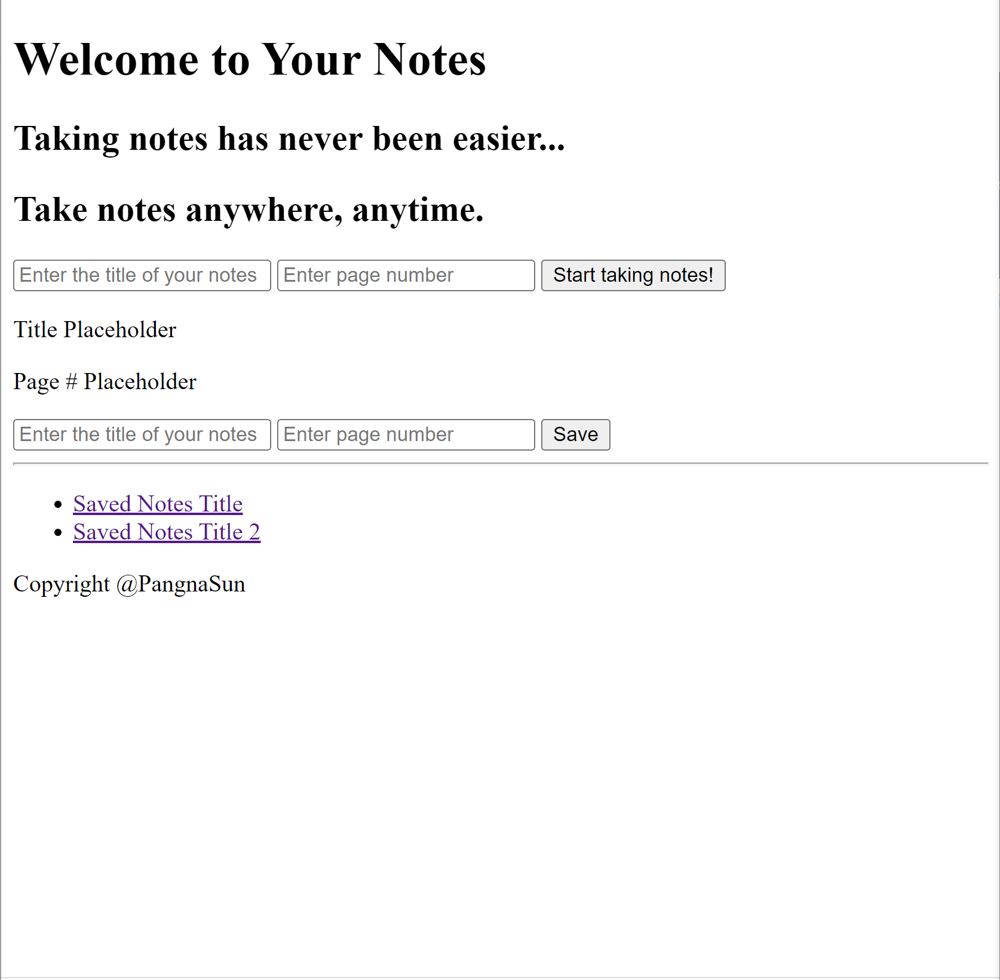
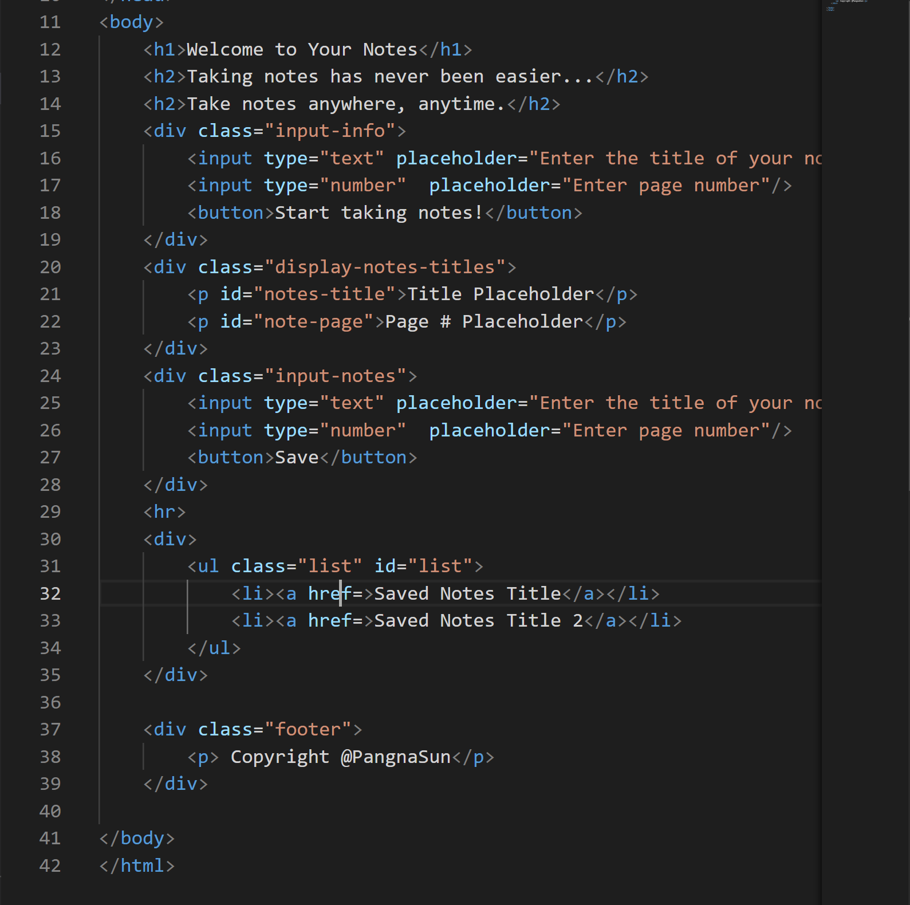
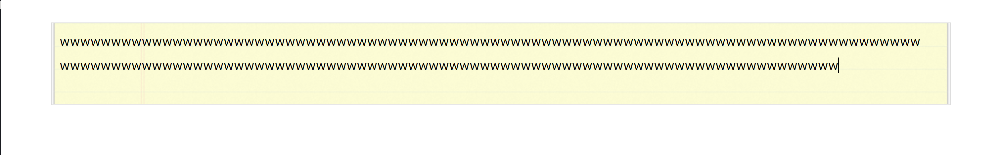
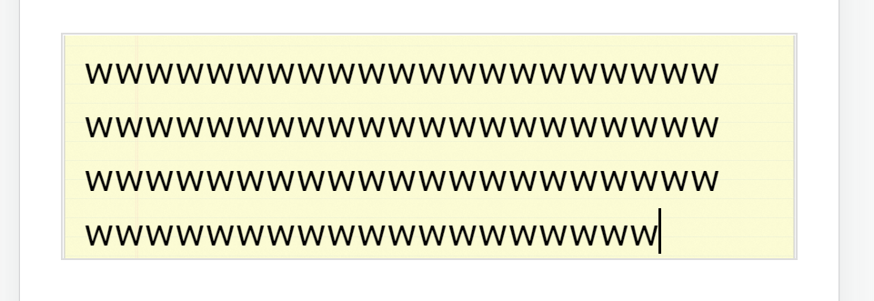
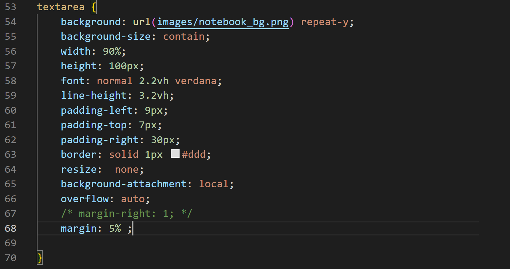
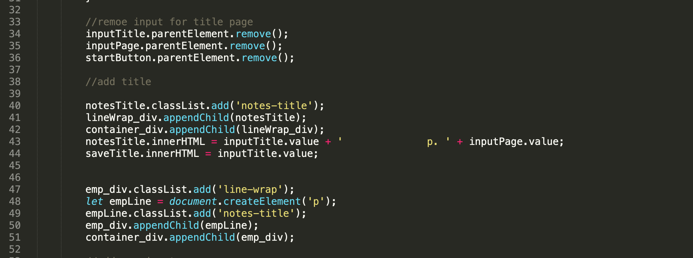
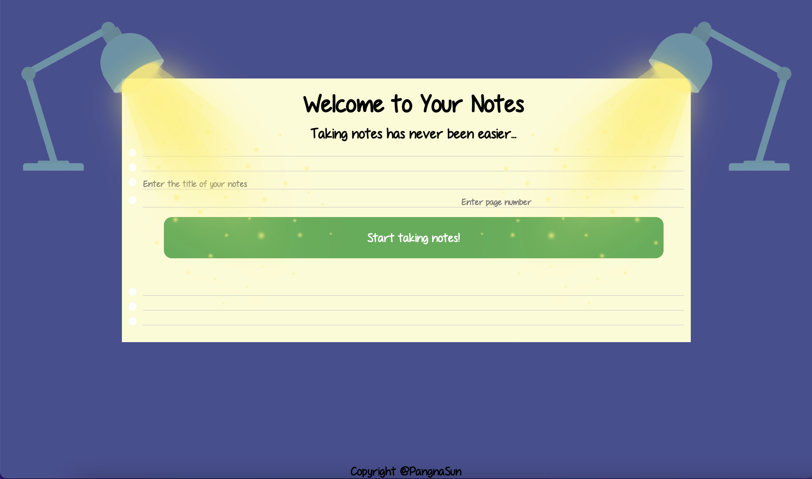

# Assignment 3: Building a Responsive Webpage

### Concept
I wanted to create a responsive webpage that allows users to take and organize notes for different texts. When using this site, users first enter the title and the first page of the text they want to annotate. Then, they can input the note for each page, update the page number, and save it by pressing Enter. When they are done taking notes for one text, all the notes will be saved under a title. They can access and edit the notes by clicking on that title. They can go the same procedure again to take notes for other texts.  

[Preview](https://pangnasun.github.io/ConnectionsLab/Week-2/Assignment3_BuidingResponsiveWebsite/)

### My Journey

#### Creating Wireframes
I started my development process by creating wireframes of my concept:

*Wireframe #1*

*Wireframe #2*

*Wireframe #3*

#### HTML Coding & CSS Styling

Using the above wireframes, I developed a basic HTML, as shown below:

*Initial Webpage Screenshot*

*Initial HTML code Screenshot*

While trying different ways to format and get user input, I tried *textarea* because I wanted the input text to go to new line when it reaches the maximum width of the input field. I also added a png of notebook page as the background, so I can duplicate the notebook effect as users inputing text. However, I faced the problem of the background image and input text size do not scale at the same proportion when the screen changes sizes. The isssue is shown below:

*Testing textarea Screenshot #1*

*Testing textarea Screenshot #2*

*Testing textarea code Screenshot*

#### Javascript
I used event listeners line *click*, *change*, *keydown*, etc. to make my webpage responsive and interactive. Then, I removed, created, and HTML elements to transit to different stages of my webpage. 

*Javascript code Screenshot*

### Final Webage

*Final Webpage Screenshot*

Pleae refer to this [link](https://pangnasun.github.io/ConnectionsLab/Week-2/Assignment3_BuidingResponsiveWebsite/)
