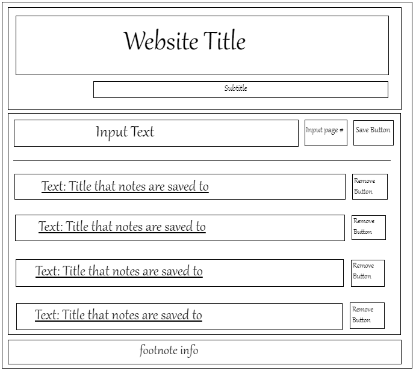
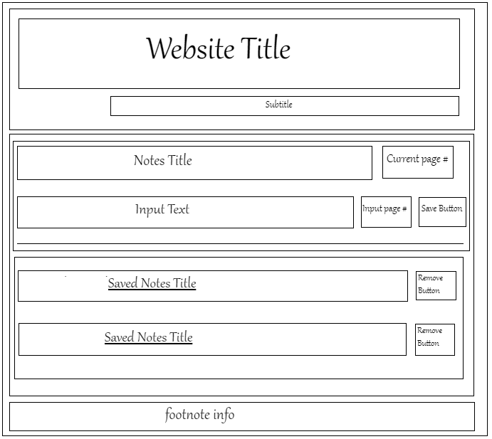
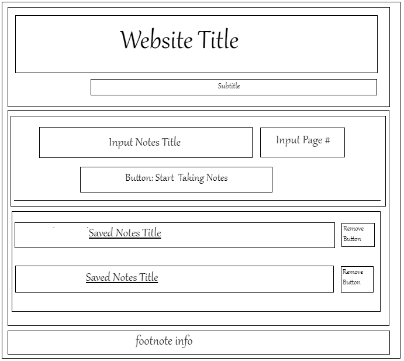

# Assignment 3: Building a Responsive Webpage

[Preview](https://pangnasun.github.io/ConnectionsLab/Week-2/Assignment3_BuidingResponsiveWebsite/)

### My Journey

#### Creating Wireframes
I started the process by creating my two wireframes:

*Wireframe #1*

*Wireframe #2*

*Wireframe #3*

I was not quite sure what to include, so designed the most basic wireframe with the elements that I know I will need on my webpage. I liked the first wireframe better, so I used it to start my HTML coding. 

#### HTML Coding & CSS Styling

*Initial Webpage Screenshot #1*

![webpage #1]9Images/webpage_v1.PNG)

*Initial Webpage Screenshot #2*

*Initial Webpage Screenshot #3*

### Javascripit

*Final Webpage Screenshot*

### Final Webage
Pleae refer to this [link](https://pangnasun.github.io/ConnectionsLab/Week-2/Assignment3_BuidingResponsiveWebsite/)
