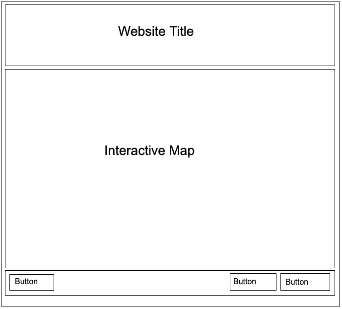
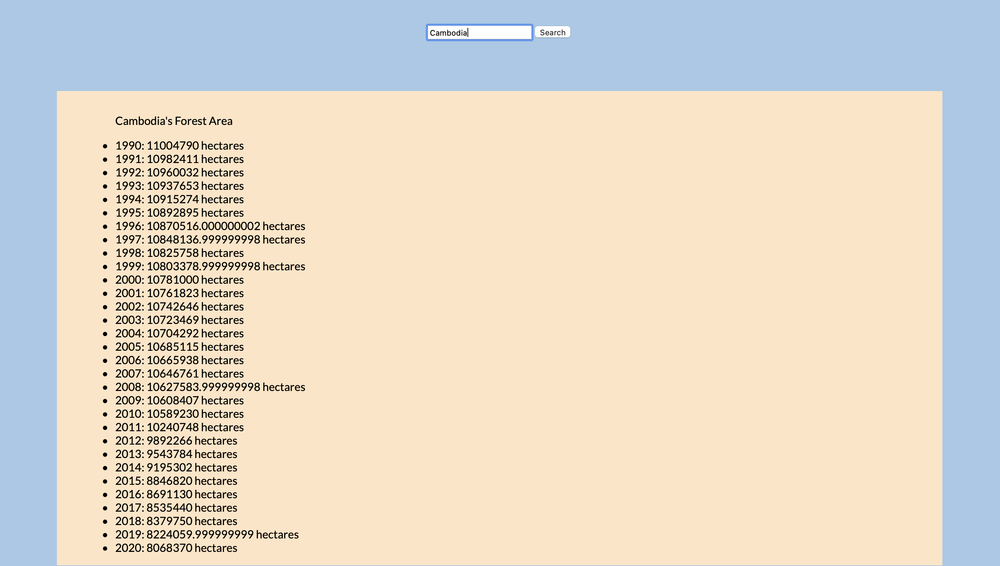
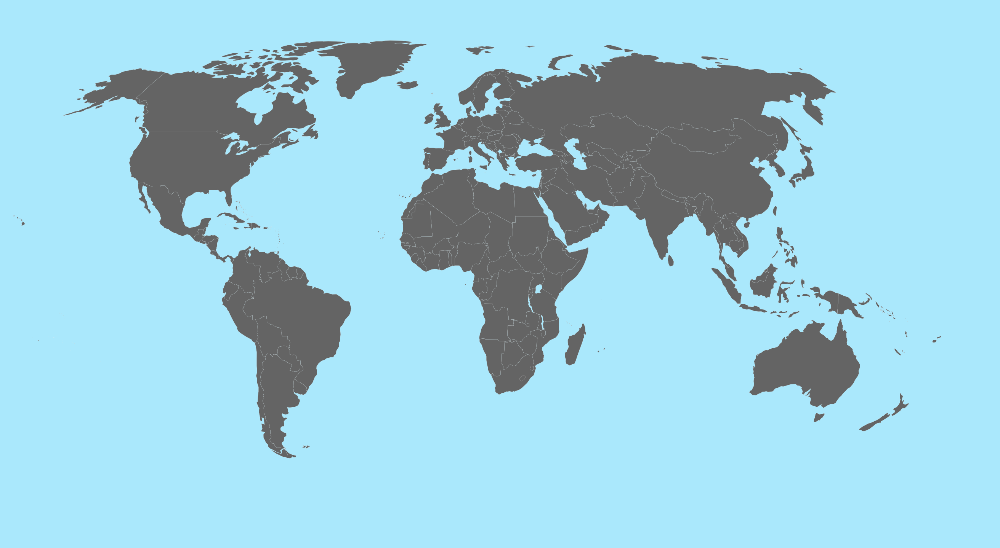
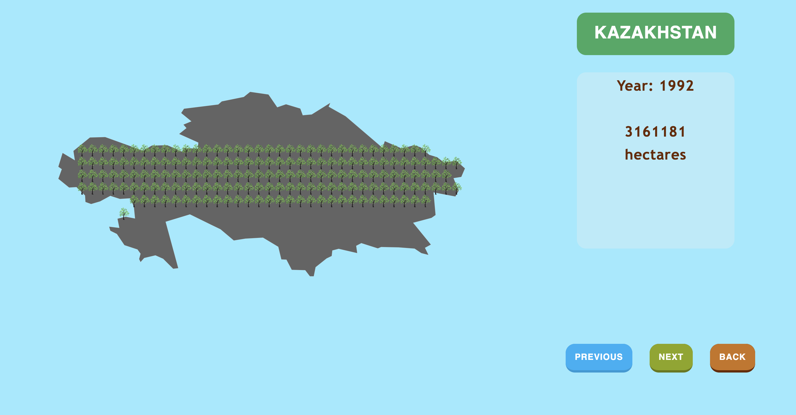

# Project1: World's Forest Area

[Preview](https://pangnasun.github.io/ConnectionsLab/Week-4/Project1/version1/)

### Concept

My first project will be a webpage that displays the world’s forest area over the last two decades (1990-2020). My aim is to make people aware of deforestation and to encourage them to help reduce deforestation. 

My webpage will use p5js to create an interactive map that users can click on each country and get information about that country’s forest area over the years. Users will also be able to change the years (1990-2020) to see how the world’s forest area changes from one year to another. In term of data, I will use two json datasets: one for the world’s forest area and another for each country’s latitude and longitude. 

### Process
#### Prototype wireframe


#### Working with *json* dataset

I started my prototype by working with a *json* dataset of the world's forest area. I successfully fetched the *json* file in *javascript* and stored the data in an array. I also created a function that takes in the data array, a country name, and a *ul* element as the function's parameters. The goal of this function is to search the name of the country within the array data and display the country's forest area over the years. If the function cannot find the input country name, it will return an error. With this function, I was able to obtain the needed information. This will come in handy when I need to display this information on the map.

```
    //fetching json file
    //fetch('forest_area.json') 
    fetch('https://sheetdb.io/api/v1/yobjwc36o8crm')
    .then(response => response.json())
    .then(data => { 

        let areaArr = data;      
        let inputCountry = document.getElementById('input-country');
        let searchButton = document.getElementById('search-button');
        inputCountry.addEventListener('keydown',(e) =>{
            //console.log('input');
            if(e.key == 'Enter')
            {
                searchCountry(areaArr, inputCountry.value,listInfo);
                inputCountry.value = '';
            }
           
        }) 

        searchButton.addEventListener('click', ()=>{
            searchCountry(areaArr, inputCountry.value,listInfo);
            inputCountry.value = '';
        })

        

    })
    .catch(function (e) {  //if pomised is rejected
        console.log('error', e);
    })
    
    //function to use the data
    //search data by country name
    function searchCountry(arr, inCountry, listInfo) 
    {
        let properCaseName = toTitleCase(inCountry);
        let index = arr.findIndex(country => country.Entity == properCaseName);
        //console.log(arr[startIndex]);
        // console.log(arr);
        listInfo.innerHTML = '';
        listInfo.style.display = 'inline';
        let lis = document.createElement('p');
        if(index == -1) {
            lis.innerHTML = inCountry + ' is not a valid country. Pls try again.';
            listInfo.appendChild(lis);
            return;
        }
        lis.innerHTML = properCaseName  + '\'s Forest Area' ;
        listInfo.appendChild(lis);

        while (arr[index].Entity == properCaseName) {
            //console.log(arr[index]);
            let lis = document.createElement('li');
            lis.innerHTML = arr[index].Year + ': ' + arr[index]['Forest area'] + ' hectares';
            listInfo.appendChild(lis);
            index++;
        }
    }

```
*Displaying Data*


#### Working with P5js

*Working the interactive map*


*Working the each country*


#### Challenges
- Familiarizing myself with P5js
    - Detecting when a country on the map is clicked
    - Scaling the shape from the center
    - Making sure trees spawn inside the shape of each country
- SheetDB has limited number of api requests
- Webpage slowed down and sometimes froze when dealing with a lot of data

#### Next Steps
-   Find better way to represent the data
-   Accurately place the tree visual based on the actual forest locations
-   Add more interactions such as suggesting possible actions to help conserve the forests
