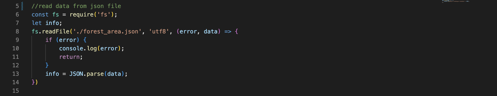
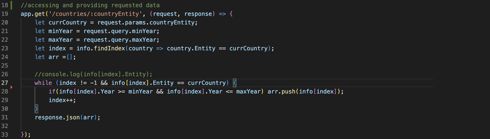
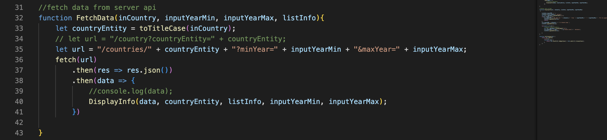

# Assignment 4: Working with Node Express

For this assignment, I created an api server by using data from a json file. The json file contains information about the world's forest from 1990-2020, which I used in my first project. I 

### Journey
I started the process by finding a way to import json data into my *index.js*. After searching for answers online, I found a *File System Module* that allows me to read file and store the data in my *javascript* variable. Then I needed to use *JSON.parse()* to format it correctly. 
*Reading from json file*

*Params & Query*

*Fetching data*

