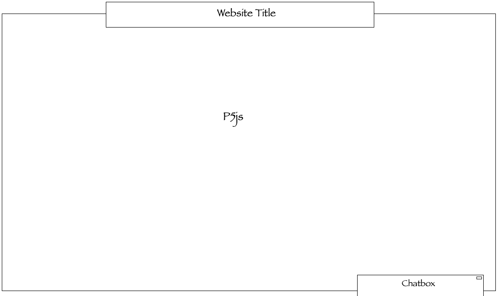
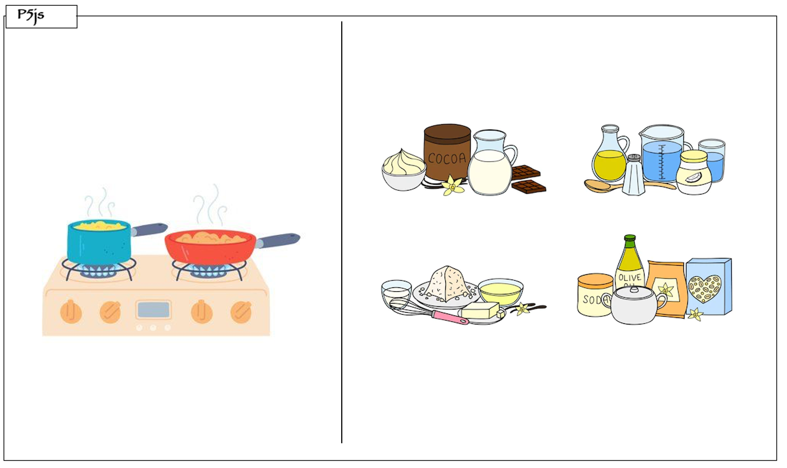

# Project 2 Proposal: Let's Cook!

### Concept
Like the name suggests, *Let's Cook!* is a multiplayer-capable online game that allows people to cook together, compete and have fun. Players are provided with various ingredients and cooking utensils to cook their dreaed foods. The game has two modes: chill and time-based. The chill mode allows players to cook food at their own pace without any time restriction. This mode is best for people who wants to relax and test out different combinations of ingredients. On the other hand, the time-based mode is very competitive because players are under a timer. The objective is to cook as many different foods as possible under the given time. The team with the highest number will claim the leaderboard. 

### Wireframes

